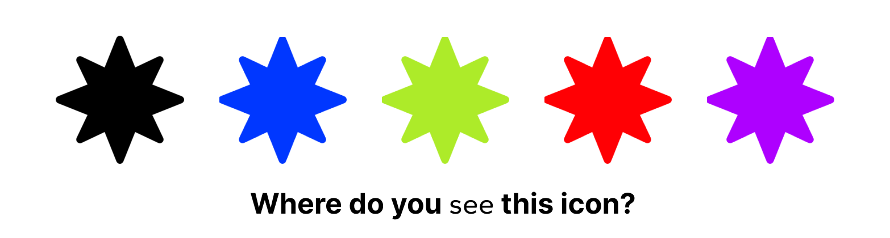

<!-- Banner atau GIF opening -->

  

  
  
  
  
    

<h3 align="center">🚀 IT Student | Web & Mobile Developer | Future Web3 Enthusiast</h3>

---

### 🌐 Connect with Me

  
  

---

### 💻 Tech Stack

  

---

  
  
  

---

### 🚀 About Me
- 🌱 Currently learning **Web3, AI-powered apps, and Cloud Computing**  
- 💡 Passionate about building **scalable web & mobile apps**  
- 🎯 Goal: Become a **Full-Stack Developer + AI/Web3 Specialist**  
- ⚡ Fun fact: I love coding at midnight 🌙  
- ☕ I rather drink kapal api than kopi susu gula aren for living

---

<h3 align="center">the end</h3>

  

